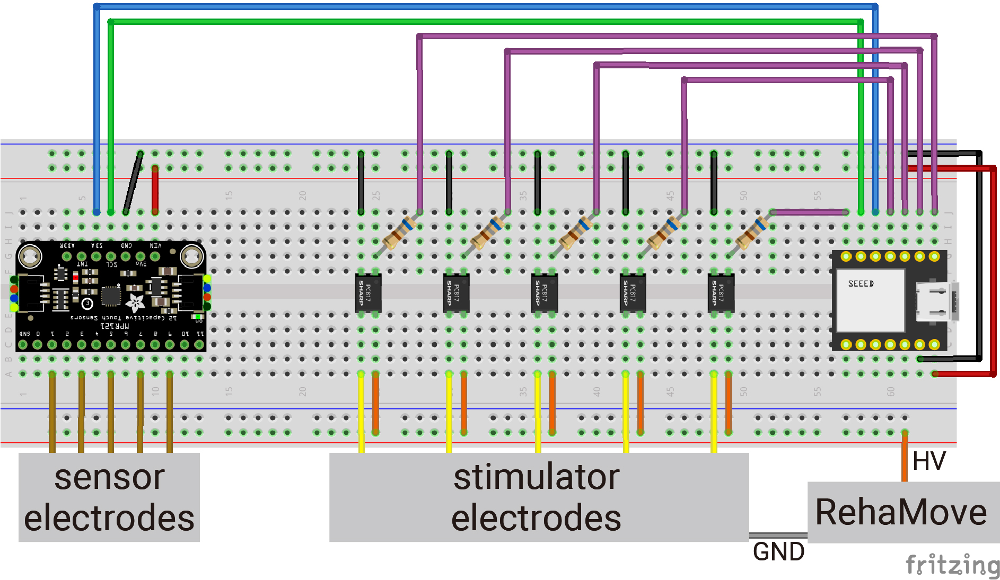

# LipIO: Enabling Lips as both Input and Output Surface
This repository includes software codes and an end-effector design file for the paper "LipIO: Enabling Lips as both Input and Output Surface" (ACM CHI2023).

**Summary:** LipIO is an open-source device that allows you to control external applications. Its hardware is built on top of an SAMD21 microcontroller (we used the Seeeduino XIAO, but you can use your favorite microcontroller), a capacitive touch sensor (we used the MPR121, but others are possible, even the built-in touch input from the SAMD21) and a electrical stimulator (we used the medical-grade Rehastim, but you can use others, such as the open-source [OpenEMSstim](https://github.com/PedroLopes/openEMSstim)). Its firmware is built using Arduino, while its software depends on what you are trying to control, here you have freedom to use it as you like and plug the data from LipIO into your own applications, we processing (P5) to create a simple vizualizer that allows you to see the data from LipIO and how to interface with any application. 

### Source Code

We share software code to sense the tongue capacitive touch, calculate the centroid, stimulate a single channel, and visualize the capacitive sensing values.

- firmware: `code/Arduino/scripts/LipIO_firmware`  
    - Add `Seeed SAMD Boards` to Arduino IDE from Boards Manager.  
    - Upload `LipIO_firmware.ino` to [Seeeduino xiao](https://wiki.seeedstudio.com/Seeeduino-XIAO/).
    - Refer to [this link](https://learn.adafruit.com/adafruit-mpr121-12-key-capacitive-touch-sensor-breakout-tutorial/wiring) about the wiring of MPR121 (capacitive touch sensor).
    - Arduino IDE 1.8.19
- visualizer: `code/Processing/scripts/LipIO_visualize`  
    - Before running Processing, upload the firmware to Seeeduino XIAO.
    - Change the `portName` constant to your correct port.
    - Type 0-4 to stimulate each electrode.
    - Processing 4.0b2

### Flexible electrodes for LipIO

The `design` directory includes the path design of the LipIO device in Adobe Illustrator and pdf format. You can print the device with conductive ink or a craft cutter.

## Schematics

## Stimulator 
Our software was tested with a medical-grade electrical stimulator, Rehastim. If you have Rehastim and want to learn more about how to control its stimulation output from your laptop (Unity, python), you should check the project page of [our open-source library](https://github.com/humancomputerintegration/rehamove-integration-lib). While we used the medical-grade Rehastim, you can use others, such as the open-source [OpenEMSstim](https://github.com/PedroLopes/openEMSstim), which we contributed too as well). 

## Citing

When using or building upon this device in an academic publication, please consider citing as follows:

Arata Jingu, Yudai Tanaka, and Pedro Lopes. 2023. LipIO: Enabling Lips as both Input and Output Surface. In Proceedings of the 2023 CHI Conference on Human Factors in Computing Systems (CHI ’23), April 23–28, 2023, Hamburg, Germany. ACM, New York, NY, USA. https://doi.org/10.1145/3544548.3580775

## contact
For any questions about this repository, please contact jingu@cs.uni-saarland.de
